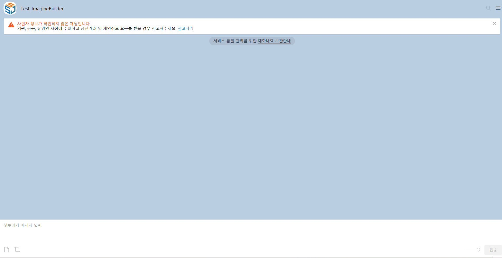
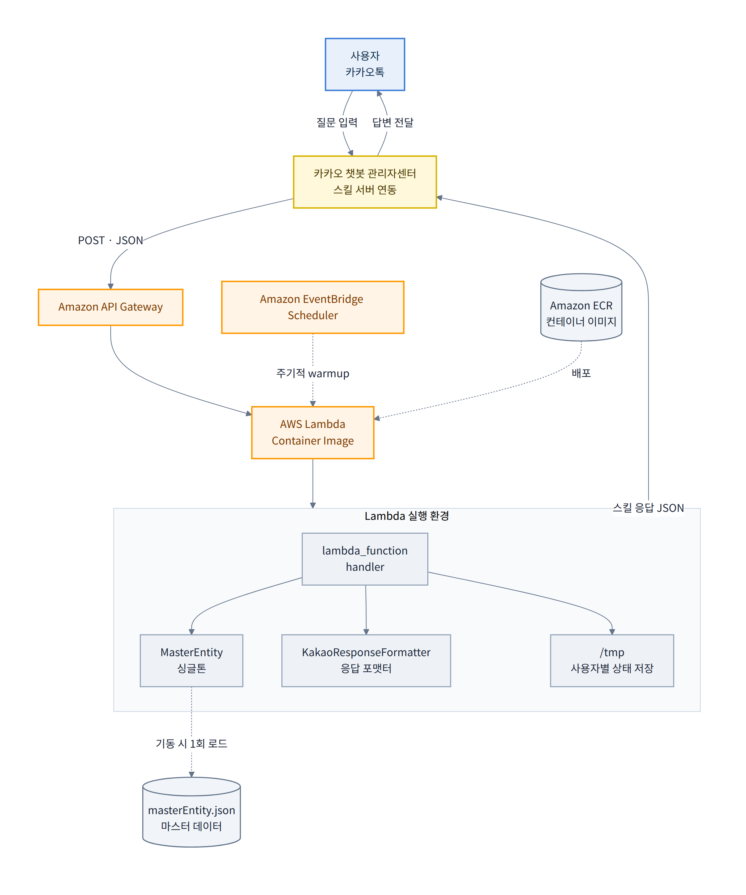
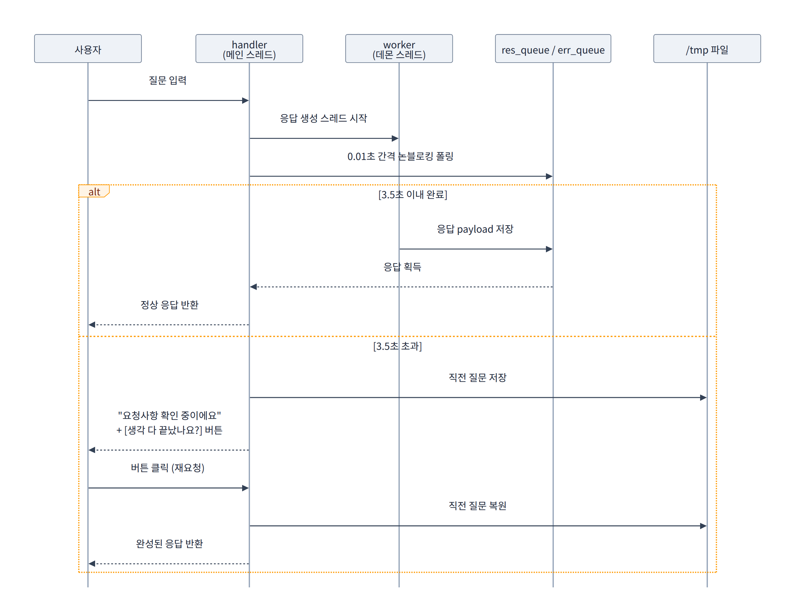
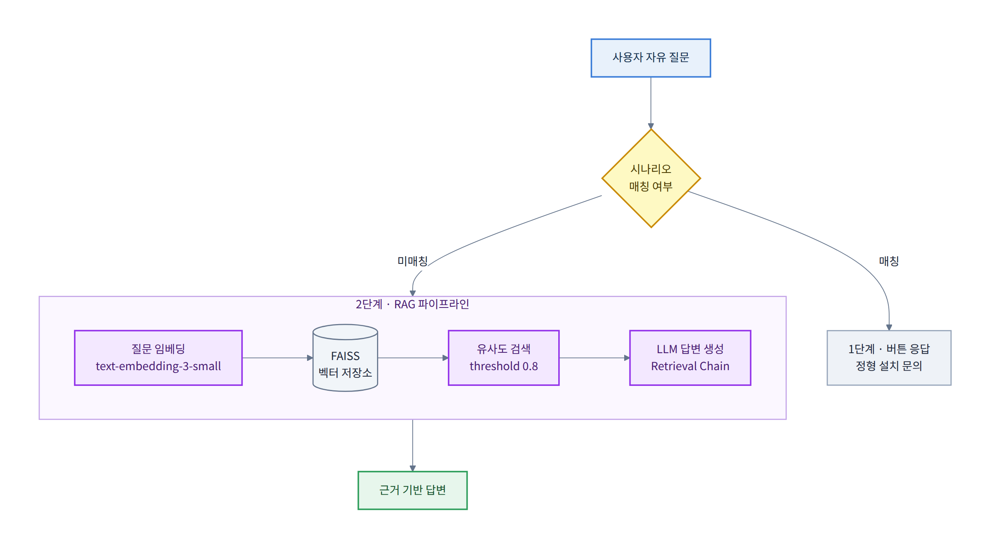

<div align="center">

# Autodesk 제품 설치 기술지원 카카오 챗봇

**오프라인 전화 상담에 집중되던 Autodesk 제품 설치 문의를<br/>카카오톡에서 24시간 자동 응대하는 서버리스(AWS Lambda) 챗봇 서비스**

㈜상상진화 · Autodesk 공식 파트너 회사 기술지원 솔루션<br/>
2024.12 ~ 2025.12 · 기획/개발/배포/운영 1인 담당

<br/>


</div>

---

## 시연



> 시작 화면 → 제품 선택 → 버전 선택 → 설치 가이드 제공까지 4단계 시나리오

<!-- TODO: GIF 준비 전이라면 스크린샷 3장을 아래 표로 대체
| 시작 화면 | 제품 선택 | 설치 가이드 |
|:---:|:---:|:---:|
|  |  |  |
-->

---

## 목차

1. [프로젝트 개요](#1-프로젝트-개요)
2. [주요 기능](#2-주요-기능)
3. [시스템 아키텍처](#3-시스템-아키텍처)
4. [핵심 기술 과제와 해결 과정](#4-핵심-기술-과제와-해결-과정)
5. [기술 스택](#5-기술-스택)
6. [프로젝트 구조](#6-프로젝트-구조)
7. [실행 및 배포](#7-실행-및-배포)
8. [개발 이력 및 주요 의사결정](#8-개발-이력-및-주요-의사결정)
9. [역할 및 기여](#9-역할-및-기여)
10. [향후 계획](#10-향후-계획)
11. [관련 저장소](#11-관련-저장소)

---

## 1. 프로젝트 개요

### 배경

㈜상상진화는 Autodesk 공식 파트너 회사로서 AutoCAD, Revit 등 제품의 설치 기술지원을 제공한다. 
그러나 기존 지원 체계는 다음과 같은 구조적 한계를 갖고 있었다.

- **채널 단일화** — 설치 문의가 전화 상담(콜센터)에 집중
- **시간 제약** — 업무 시간 외 문의는 다음 영업일까지 대기
- **반복 응대** — 설치 문의 상당수가 "제품별·버전별 표준 설치 절차" 안내로, 매번 동일한 내용을 기술지원 엔지니어가 구두로 반복 처리
- **자료 분산** — 설치 가이드가 담당자별 문서로 흩어져 안내 내용이 일관되지 않음

### 목표

기존 오프라인 기술지원을 **온라인에서도 동일한 품질로 받을 수 있도록** 카카오톡 채널 기반 자동 응대 서비스를 구축했다.

1. 제품·버전 선택만으로 **표준화된 설치 가이드** 즉시 제공
2. 서버 상시 운영 없이 **서버리스(AWS Lambda) 구조로 운영 비용 최소화**
3. 안내 문구·설치 링크를 **masterEntity.json 마스터 데이터(JSON)로 분리**하여 비개발자도 콘텐츠 수정 가능
4. 향후 **LLM 모델 기반 자유 질의응답 가능한 AI Assistant** 서비스로 확장 가능한 구조 확보

### 결과

| 항목 | 내용 |
|---|---|
| 지원 제품 | **8종** — Autodesk 5종(AutoCAD, Revit, Navisworks Manage, InfraWorks, Civil3D) + 자사 BOX 3종(RevitBOX, CADBOX, EnergyBOX) |
| 지원 버전 | Autodesk 2023-2026 / BOX 제품 2022-2026 |
| 시나리오 | 4단계 계층형 대화 흐름 (start → level1 → level2 → level3 → end) |
| 운영 형태 | 서버리스(AWS Lambda) — 요청당 과금, 상시 인스턴스 없음 |

---

## 2. 주요 기능

### 계층형 제품 설치 가이드 제공

사용자가 자연어로 질문할 필요 없이, **버튼 선택만으로** 원하는 설치 가이드를 안내 받을 수 있다.

```
시작 화면
  ├─ AI Assistant          (개발 중단!)
  ├─ 원격 지원              → 원격 지원 프로그램 다운로드 안내
  └─ 챗봇 문의
       ├─ Autodesk 제품 설치 지원
       │    └─ AutoCAD / Revit / Navisworks Manage / InfraWorks / Civil3D
       │         └─ 버전 선택 → 설치 가이드 + 동영상 링크
       └─ 상상진화 BOX 제품 설치 지원
            └─ RevitBOX / CADBOX / EnergyBOX
                 └─ 버전 선택 → 설치 가이드 + 동영상 링크
```

### 마스터 데이터 기반 콘텐츠 관리

모든 안내 문구·버튼·카드 구성은 `masterEntity.json` 파일 하나로 관리된다.
신규 제품이나 버전을 추가할 때 **애플리케이션 코드를 수정할 필요 없다.**

```
masterEntity
├── startCard        시작 화면 (basicCard)
├── chatbotCard      챗봇 문의 (carousel)
├── adskReplies      Autodesk 제품 선택 (quickReplies)
├── adskVerReplies   Autodesk 버전 선택 (quickReplies)
├── boxReplies       BOX 제품 선택 (quickReplies)
├── boxVerReplies    BOX 버전 선택 (quickReplies)
├── endCard          제품별 설치 가이드 본문 (8종 Infos)
└── emptyResponse    시나리오 외 일반 문의 처리
```

### 응답 지연 대응 UX

카카오톡 서버 5초 응답 제한을 초과하는 상황에서도 **채팅방이 멈추지 않도록** 재요청 흐름을 제공한다. (상세: [4-1](#4-1-카카오톡-5초-응답-제한-대응))

### 데이터 무결성 검증

서비스 시작 시 마스터 데이터의 필수 키·값 존재 여부를 전수 검사하여, 잘못된 데이터로 인한 런타임 오류를 사전에 차단한다. 검사 결과는 `IntEnum` 열거형으로 4단계 상태를 반환한다.

| 상태 | 값 | 의미 |
|---|---:|---|
| `DATA_TYPE_MISMATCH` | -2 | 데이터 타입 불일치 |
| `VALIDATION_ERROR` | -1 | 유효성 검사 중 예외 발생 |
| `NOT_EXISTENCE` | 0 | 필수 데이터 누락 |
| `EXISTENCE` | 1 | 정상 |

---

## 3. 시스템 아키텍처

### 전체 구성



### 핵심 설계 원칙

| 원칙 | 적용 내용 |
|---|---|
| **콜드 스타트 최소화** | MasterEntity 마스터 데이터 싱글톤 인스턴스를 `handler` **바깥**에서 생성 → 웜 스타트 진행 시 마스터 데이터 재로드 없이 재사용 가능 |
| **관심사 분리** | 라우팅(`lambda_function`) / 응답 포맷(`kakao`) / 데이터(`singleton`) / 로깅(`log`) / 인프라 유틸(`aws`) 들을 모듈 단위로 분리 |
| **데이터-코드 분리** | 문구·링크·버튼은 전부 masterEntity.json JSON. 코드는 "구조를 만드는 역할"만 수행 |
| **문자열 상수 중앙화** | 모든 키·문구를 `chatbot_helper.py`에 집약하여 오타로 인한 런타임 오류 차단 |
| **실패 시 안전한 응답** | 어떤 예외가 나도 카카오톡에는 항상 유효한 JSON 데이터 반환 (채팅방 멈춤 방지) |

---

## 4. 핵심 기술 과제와 해결 과정

### 4-1. 카카오톡 5초 응답 제한 대응

**문제**<br/>
카카오톡 스킬 서버는 5초 내에 응답하지 않으면 채팅방이 멈춤 상태가 된다.
사용자 입장에서는 "챗봇이 오류 발생했다"고 인식되어 컴플레인 (Complain)을 제기하고 심한 경우 챗봇 채널 탈퇴로 이어진다.

**분석**<br/>
5초 전체를 카카오 응답 생성에 쓸 수 없다.
카카오톡 서버 ↔ API Gateway ↔ AWS Lambda 간 왕복 통신 시간을 약 1.5초로 산정하면, **실제 응답 처리 가용 시간은 3.5초**이다.

**해결**<br/>
응답 생성을 데몬 스레드로 분리하고, 메인 핸들러는 큐를 논블로킹 폴링하도록 설계했다.
제한 시간 초과 시 직전 질문을 `/tmp`에 저장한 뒤, 재요청용 바로가기 버튼을 즉시 반환한다.



**추가 고려**<br/>
스레드 내부 예외가 메인 핸들러에서 유실되지 않도록 `thread_wrapper`를 두어 `err_queue`로 전파하고,
응답 큐보다 **오류 큐를 먼저 확인**하도록 폴링 순서를 정했다.
오류 상황에서 3.5초를 낭비하지 않기 위한 선택이다.

**결과**<br/>
응답 지연 시에도 채팅방 멈춤 현상이 발생하지 않으며, 사용자는 버튼 한 번으로 결과를 받아볼 수 있다.

---

### 4-2. AWS Lambda 콜드 스타트

**문제**<br/>
일정 시간 호출이 없으면 AWS Lambda 컨테이너가 회수되어,
다음 요청 시 초기화 과정(컨테이너 기동 + 의존성 로드 + 마스터 데이터 파싱)에 수 초가 소요된다. 
4-1의 3.5초 실제 응답 처리 가용 시간을 그대로 초과한다.

**검토한 선택지**

| 방안 | 판단 |
|---|---|
| Provisioned Concurrency | 상시 과금 발생. 문의량이 업무시간에 집중되는 해당 챗봇 서비스에는 과잉 투자라고 판단 |
| EventBridge Scheduler warmup | 주기적 더미 호출로 컨테이너 유지. 호출 비용이 미미하여 채택함 |
| 초기화 로직 경량화 | 병행 적용 |

**해결**<br/>
EventBridge Scheduler가 아래 페이로드를 주기적으로 전송하고,
핸들러는 이를 **가장 먼저 감지**하여 실제 응답 생성 없이 즉시 반환한다.

```json
{ "body": "{ \"action\": \"aws-lambda_function-container-warmup\" }" }
```

동시에 MasterEntity 마스터 데이터 싱글톤 인스턴스와 KakaoResponseFormatter 응답 포맷터 인스턴스를 `handler` 함수 바깥(모듈 스코프)에 배치하여, 웜 스타트 진행 시 JSON 재파싱과 유효성 검사를 건너뛰도록 했다.

---

### 4-3. 배포 패키지 용량 한계

**문제**<br/>
추후 다른 프로젝트에서 AI Assistant 기능 확장을 하기 위해
LangChain, FAISS, OpenAI SDK를 배포 범위에 포함하려고 시도하자 **Lambda ZIP 업로드 한계(250MB, 압축 해제 기준)** 를 초과했다.

**해결**<br/>
컨테이너 이미지 방식(최대 10GB)으로 전환하고, 멀티 스테이지 빌드를 적용했다.

```dockerfile
# Stage 1 — 빌드 전용: 컴파일 도구 설치 및 의존성 빌드 처리
FROM public.ecr.aws/lambda/python:3.11 AS build
RUN yum install -y gcc gcc-c++ make python3-devel && yum clean all
COPY requirements.txt .
RUN pip install --no-cache-dir -r requirements.txt --target /tmp/python

# Stage 2 — 런타임: 빌드 산출물만 복사, 컴파일 도구 미포함
FROM public.ecr.aws/lambda/python:3.11 AS runtime
COPY --from=build /tmp/python /var/task/
COPY . .
CMD ["lambda_function.handler"]
```

**효과**
- `requirements.txt` 파일 먼저 복사 및 **의존성 레이어 캐싱** → 코드만 수정 시 빌드 시간 대폭 단축
- 컴파일 도구(`gcc`, `make` 등)가 최종 이미지에 포함되지 않아 **이미지 경량화 + 공격 표면 축소**
- `.dockerignore` 사용하여 테스트 코드·문서 배포 대상 제외

---

### 4-4. 의존성 버전 충돌

AWS Lambda 런타임 환경에서만 재현되는 문제들을 해결한 기록이다.

| 증상 | 원인 | 해결 |
|---|---|---|
| `module 'faiss' has no attribute 'IndexFlatL2'`<br/>`numpy.core.multiarray failed to import` | FAISS가 요구하는 ABI와 NumPy 2.x 불일치 | `numpy==1.26.2`로 고정 |
| `unsupported version of sqlite3. Chroma requires sqlite3 >= 3.35.0` | Amazon Linux 기반 이미지의 sqlite3 버전이 낮음 | 벡터 저장소를 **Chroma → FAISS**로 전환 (외부 DB 의존성 제거) |
| `LangChainDeprecationWarning` 다수 | LangChain 0.1 → 0.2 패키지 재편 | `langchain_community`, `langchain_openai`, `langchain_core`로 임포트 경로 정리 |

**배운 점** — 로컬(Windows)과 배포 환경(Amazon Linux)의 시스템 라이브러리 차이가 런타임 오류로 이어질 수 있으며,
컨테이너 기반 배포가 이 격차를 줄이는 근본 해결책이라는 것을 경험했다.

---

### 4-5. 시나리오 분기 하드코딩 로직 보완

**문제**<br/>
초기 구현한 해당 챗봇 로직의 경우 사용자 입력에 대한 `if-elif` 분기가 코드에 직접 작성되어 있었다.
다만, 제품이 8종으로 늘고 버전 분기가 추가되자 조건문이 비대해졌고, 문구 하나를 수정하려 해도 코드 배포가 필요했다.

**해결**<br/>
분기를 **딕셔너리 + 람다 매핑 테이블**로 치환 및 매칭 방식을 아래처럼 두 단계로 나눴다.

```python
eq_operator_mappings = {   # 정확히 일치 — 메뉴 버튼 클릭
    "/start":                    lambda: self.__common_basicCard(...),
    "Autodesk 제품 설치 지원":    lambda: self.__common_quickReplies(...),
    "AutoCAD":                   lambda: self.__common_ver_quickReplies(...),
}

in_operator_mappings = {   # 부분 포함 — "Inst - AutoCAD 2025, 2026 버전 공통 설치 방법"
    "Inst - AutoCAD": lambda: self.__end_basicCard(...),
    "Inst - Revit":   lambda: self.__end_basicCard(...),
}
```

eq_operator_mappings 정확히 일치를 먼저 순회하고 매칭 시 즉시 반환하여 불필요한 탐색을 줄였다.
어떤 규칙에도 걸리지 않으면 시작 화면으로 되돌려, 사용자가 임의의 문장을 입력해도 대화가 끊기지 않도록 했다.

**결과** — 신규 제품 추가 시 **masterEntity.json JSON 파일에 항목 추가 + 매핑 1줄**로 대응 가능해졌다.

---

### 4-6. 서버리스 환경의 사용자별 상태 관리

**문제**<br/>
AWS Lambda는 상태를 유지하지 않으며 여러 사용자의 요청이 동일 컨테이너에서 처리될 수 있다.
4-1의 재요청 기능을 구현하려면 "직전 질문"을 사용자별로 보관해야 하는데, 
전역 변수를 쓰면 **사용자 간 데이터 혼선(Race Condition)** 이 발생한다.

**해결**<br/>
AWS Lambda의 `/tmp` 임시 스토리지를 사용하되, 카카오톡 사용자 ID를 파일명에 포함시켜 사용자별로 격리했다.

```
(예시)
/tmp/user_id{사용자ID}_chatbot.txt
```

`threading.local()` 기반 방식도 검토했으나, 스레드가 재사용되는 환경에서 이전 사용자 데이터가 남을 위험이 있어 파일 기반 격리를 선택했다.

**한계 인식** — `/tmp`는 컨테이너 생명주기에 종속되므로 데이터를 영구적으로 보관하는 저장소가 아니다.
다중 턴 대화 이력이 필요한 AI Assistant 관련 기능 구현 진행 시 **DynamoDB 또는 ElastiCache 도입이 필요**하다고 생각한다.

**참고(DynamoDB)** — [바로가기](https://docs.aws.amazon.com/ko_kr/amazondynamodb/latest/developerguide/Introduction.html)

**참고(ElastiCache)** — [바로가기](https://docs.aws.amazon.com/ko_kr/AmazonElastiCache/latest/dg/WhatIs.html)

---

### 4-7. 서버리스 환경 로깅 체계

**문제**<br/>
AWS Lambda 기본 로그는 UTC 기준이며 최상위 로거를 공유한다.
국내 운영 서비스에서 장애 발생 시각을 대한민국 표준시로 파악하기 어려웠고, 어느 모듈에서 발생한 로그인지 추적이 힘들었다.

**해결**<br/>
`logging.Formatter`를 상속한 `KSTFormatter`를 싱글톤 인스턴스로 구현해 시각을 대한민국 표준시(KST)로 변환하고,
전용 네임스페이스 로거에 `propagate = False`를 설정해 AWS Lambda 기본 로거와 분리했다.

```
[INFO] [2025-11-25 14:32:07] [lambda_function.py | handler - L142]: 채팅 입력 사용자 아이디: ...
```

로그 레벨은 `LOG_LEVEL` 환경 변수로 제어하여, 코드 수정 없이 운영 중 디버그 레벨을 조정할 수 있도록 했다.
또한 순환 참조를 피하기 위해, 전역 로거 초기화 이전 단계에서 동작하는 모듈용으로 `inspect` 기반 경량 로거(`chatbot_logger.py`) 별도 구현 및 사용했다.

---

## 5. 기술 스택

### 언어 및 런타임


Type Hints, `IntEnum`, `dataclass` 스타일 상수 관리, PEP 257 기반 Docstring 적용

### 클라우드 인프라

| 서비스 | 용도 |
|---|---|
| **AWS Lambda** | 챗봇 응답 처리 (컨테이너 이미지 배포) |
| **Amazon API Gateway** | 카카오 스킬 서버 HTTP 엔드포인트 |
| **Amazon ECR** | 컨테이너 이미지 프라이빗 저장소 |
| **Amazon EventBridge Scheduler** | 콜드 스타트 방지 warmup 스케줄링 |
| **Amazon CloudWatch Logs** | 운영 로그 수집 및 장애 추적 |

### 라이브러리

| 구분 | 사용 기술 |
|---|---|
| 동시성 | `threading`, `queue.Queue` |
| AWS 연동 | `aws-lambda-powertools` (LambdaContext 타입 지원) |
| LLM · RAG *(2단계 - 개발 중단!)* | `openai`, `langchain-openai`, `langchain-community`, `faiss-cpu` |
| 로깅 | `logging`, `zoneinfo`, `inspect` |
| 컨테이너 | Docker (멀티 스테이지 빌드) |

### 적용한 설계 디자인 패턴

- **싱글톤 패턴** — `SingletonBase`를 상속받는 `MasterEntity`, `KSTFormatter`. AWS Lambda 웜 스타트 진행 시 인스턴스 재사용으로 초기화 비용 절감
- **Facade 패턴** — `KakaoResponseFormatter`가 복잡한 카카오 스킬 응답 스펙(basicCard / carousel / quickReplies)을 단일 인터페이스로 은닉 처리
- **전략 패턴 (딕셔너리 디스패치)** — 조건 분기를 매핑 테이블로 대체
- **참고 (파이썬 디자인패턴 스터디)** — [바로가기](https://github.com/minjaejeon0827/test_Python_Design_Pattern)

---

## 6. 프로젝트 구조

```
kakaoChatbot/
├── commons/
│   └── chatbot_helper.py        전역 상수·문구 중앙 관리 (모든 키/메시지 단일 출처)
├── modules/
│   ├── kakao.py                 카카오 스킬 응답 JSON 포맷터 (basicCard/carousel/quickReplies)
│   ├── singleton.py             싱글톤 패턴 기반 클래스, 마스터 데이터 관리, KST 로그 포매터
│   └── chatbot_enum.py          데이터 유효성 검사 IntEnum 열거형
├── restAPI/
│   └── chatbot_restServer.py    마스터 데이터 비동기 로딩 (async/await)
├── utils/
│   ├── log.py                   전역 로거 초기화 (logging + KST + 환경변수 레벨 제어)
│   ├── chatbot_logger.py        경량 로거 (전역 로거 초기화 이전 단계 전용)
│   ├── aws.py                   AWS Lambda /tmp 임시 스토리지 입출력 유틸
│   └── openAI.py                LLM·RAG 유틸 (2단계 AI Assistant - 개발 중단!)
├── resources/
|   ├── assets/                  카카오 챗봇 정적 자원 (Static Assets)
|   ├── image/                   카카오 스킬 응답 데이터 이미지
|   ├── text/                    Autodesk 제품별 설치 방법 텍스트 파일
│   └── json/
│       └── masterEntity.json    챗봇 시나리오 마스터 데이터
├── tests/                       모듈별 테스트 코드
├── lambda_function.py           AWS Lambda 진입점 (handler)
├── Dockerfile                   멀티 스테이지 빌드 정의
├── requirements.txt
└── README.md                    프로젝트 메인 README
```

### 모듈 임포트 순서

순환 참조를 방지하기 위해 임포트 순서를 고정했다.

```
1. commons/chatbot_helper   (의존성 없음 — 상수만 보유)
2. modules/singleton        (KSTFormatter 정의)
3. utils/log                (KSTFormatter를 사용하므로 2번 이후 임포트 처리)
4. 나머지 모듈
```

---

## 7. 실행 및 배포

### 사전 요구사항

- Python 3.11 이상
- Docker
- AWS CLI (자격 증명 설정 완료)
- 카카오 챗봇 관리자센터 관리자 계정

### 로컬 실행

```bash
git clone https://github.com/minjaejeon0827/KakaoChatbot.git
cd kakaoChatbot

python -m venv kakaoChatbot_env
source kakaoChatbot_env/bin/activate      # Windows: kakaoChatbot_env\Scripts\activate.bat

pip install -r requirements.txt
```

### 환경 변수

```ini
# .env  (Git 커밋 대상 제외)
OPENAI_API_KEY=<your-openai-api-key>
LOG_LEVEL=INFO
```

### 배포

```bash
# 1) AWS ECR 로그인
aws ecr get-login-password --region ap-northeast-2 \
  | docker login --username AWS --password-stdin \
    <AWS_ACCOUNT_ID>.dkr.ecr.ap-northeast-2.amazonaws.com

# 2) 이미지 빌드
docker build -t kakao-chatbot .

# 3) 태그 지정 및 푸시
docker tag kakao-chatbot:latest \
  <AWS_ACCOUNT_ID>.dkr.ecr.ap-northeast-2.amazonaws.com/kakao-chatbot:latest
docker push \
  <AWS_ACCOUNT_ID>.dkr.ecr.ap-northeast-2.amazonaws.com/kakao-chatbot:latest

# 4) AWS Lambda 콘솔에서 새 이미지 배포
# 5) 카카오 챗봇 관리자센터에서 전체 배포
```

### AWS 리소스 구성 순서

```
AWS ECR 프라이빗 저장소 생성
  → AWS Lambda 함수 생성 (컨테이너 이미지 기반)
    → API Gateway 생성 및 Lambda 연동
      → EventBridge Scheduler 규칙 생성 (warmup)
        → 카카오 챗봇 관리자센터 스킬 서버에 API Gateway 엔드포인트 등록
```

---

## 8. 개발 이력 및 주요 의사결정

단순하게 날짜 순서대로 나열하는 것이 아니라, **무엇을 왜 바꿨는지** 기록했다.

| 시기 | 의사결정 | 배경 |
|---|---|---|
| 2024.12 | 프로젝트 착수 (PM · 웹개발자 · 개발자 3인 체제) | Autodesk 제품 설치 오프라인 기술지원의 온라인 확장 요구 |
| 2025.01–03 | 카카오 챗봇 관리자센터 + AWS Lambda 서버리스 아키텍처 확정 | 상시 서버 운영 비용 대비 요청량이 낮아 서버리스(AWS Lambda)가 유리하다고 판단 |
| 2025.04 | **1인 개발 체제 전환** | 초기 참여 PM·웹개발자 퇴사. 기획·개발·배포·운영 전 범위 단독 수행 |
| 2025.05 | ZIP → **컨테이너 이미지 배포** 전환 | LangChain·FAISS 의존성이 250MB 한계 초과 ([4-3](#4-3-배포-패키지-용량-한계)) |
| 2025.05 | 벡터 저장소 **Chroma → FAISS** | Amazon Linux의 sqlite3 버전 제약 ([4-4](#4-4-의존성-버전-충돌)) |
| 2025.07 | **콜드 스타트 대응** — EventBridge warmup 도입 | 초기 응답 지연이 카카오 5초 제한 초과 ([4-2](#4-2-aws-lambda-콜드-스타트)) |
| 2025.07 | 응답 지연 시 **재요청 UX** 설계 | 채팅방 멈춤으로 인한 사용자 챗봇 채널 탈퇴 방지 ([4-1](#4-1-카카오톡-5초-응답-제한-대응)) |
| 2025.08 | 마스터 데이터 JSON **구조 재설계** | 제품 8종 확장에 따라 카드/바로가기 스키마 통일 |
| 2025.09 | `lambda_function.py` **전면 리팩토링** | 핸들러 비대화 해소 — 파싱·스레드·대기·포맷 책임 분리 |
| 2025.09 | 전역 로깅 체계 도입 (`logging` + KST) | 운영 중 장애 추적 시간 단축 ([4-7](#4-7-서버리스-환경-로깅-체계)) |
| 2025.10 | 조건 분기 → **딕셔너리 디스패치** 전환 | 제품 확장 시 코드 수정 최소화 ([4-5](#4-5-시나리오-분기-하드코딩-제거)) |
| 2025.11 | Navisworks Simulate → **InfraWorks 대체** | 제품 판매 중단에 따른 지원 대상 조정 |
| 2025.12 | 통합 테스트 진행 | 챗봇 서비스 베타 버전 배포 직전 통합 테스트 작업 필요하다고 판단 |

---

## 9. 역할 및 기여

**전민재: 프로젝트 리더 · 단독 개발자 (2025.04 이후)**

초기 3인 체제로 시작했으나 PM과 웹개발자의 퇴사로 2025년 4월부터 단독으로 프로젝트를 이어받아 완료했다.

| 영역 | 수행 내용 |
|---|---|
| 기획 | 기술지원 업무 프로세스 분석 → 4단계 대화 시나리오 설계, 제품 8종 지원 범위 정의 |
| 아키텍처 | 서버리스(AWS Lambda) 구조 설계, 모듈 분리 및 임포트 순서 정의, 데이터-코드 분리 원칙 수립 |
| 개발 | 전체 코드 작성 — 라우팅, 카카오 응답 포맷터, 동시성 처리, 유효성 검사, 로깅 |
| 인프라 | AWS ECR · Lambda · API Gateway · EventBridge 구성, Docker 멀티 스테이지 빌드 |
| 운영 | CloudWatch 기반 장애 대응, 제품/버전 변경 반영, 콘텐츠 갱신 |
| 문서화 | 전체 모듈 Docstring 작성, 설계 의사결정 기록 |

**이 과정에서 얻은 것**

기존 오프라인 기술지원 서비스를 온라인으로 확장하는 일은 도전적인 과제였다.
함께 시작한 팀원들이 떠난 뒤 1인 개발로 마무리하면서, 기획부터 운영까지 프로젝트 전체 주기를 책임지는 경험을 하였다.
특히 **"카카오톡 5초 응답 제한"이라는 외부 플랫폼 제약을 아키텍처 설계로 해결**하는 과정에서, 기술 선택이 곧 사용자 경험을 결정한다는 것을 배웠다.
이 경험을 바탕으로 앞으로는 사용자의 문제를 실제로 해결하는데 도움을 주는 AI 서비스를 개발하고 싶다.

---

## 10. 향후 계획

본 프로젝트는 **2단계 확장 구조**로 설계되었다.

### 1단계 — 규칙 기반 시나리오 카카오 챗봇 `완료 · 정석 서비스 오픈 중단!`

마스터 데이터 기반의 계층형 버튼 응대. 정형화된 설치 문의를 100% 자동 처리한다.

### 2단계 — LLM · RAG 기반 AI Assistant `개발 중단!`

버튼 시나리오로 처리할 수 없는 **자유 형식 질문**에 대응하는 것이 목표이다.
현시점 기준 `utils/openAI.py`에 RAG 파이프라인 PoC 관련 기능이 구현되어 있다.
향후 다른 프로젝트에서 LLM · RAG 기반 AI Assistant 개발 진행 시
`utils/openAI.py`에 구현된 RAG 파이프라인 PoC 관련 기능을 참고할 것이다.



| 구성 요소 | 현재 구현 |
|---|---|
| 문서 분할 | `CharacterTextSplitter` (chunk 1000 / overlap 200) |
| 임베딩 | `text-embedding-3-small` |
| 벡터 저장소 | FAISS (In-Memory) |
| 검색 | `similarity_score_threshold` 방식, threshold 0.8 |
| 생성 | `create_stuff_documents_chain` + `create_retrieval_chain` |

**해결해야 할 과제**

- [ ] **응답 시간** — RAG 파이프라인 PoC 관련 전체 기능 실행 시 실제 응답 처리 가용 시간 3.5초 초과.
벡터 인덱스 사전 빌드 및 캐싱 필요
- [ ] **검색 실패 대응** — threshold 0.8 미만 시 관련 문서 미검색. 임계값 튜닝 또는 폴백 전략 수립
- [ ] **대화 이력 관리** — `/tmp` 대신 DynamoDB 등 데이터를 영구적으로 저장 가능한 저장소 도입 필요 ([4-6](#4-6-서버리스-환경의-사용자별-상태-관리))
- [ ] **환각 억제** — 추후 다른 프로젝트에서 개발한 AI Assistant가 오답 안내 시 사용자에게 실질적 불편함 발생.
근거 문서 미검색 시 상담원 연결로 전환하는 안전장치 필요
- [ ] **비용 관리** — 임베딩·생성 API 호출량 모니터링 및 상한 설정

---

## 11. 관련 저장소

| 저장소 | 내용 |
|---|---|
| [KakaoChatbot](https://github.com/minjaejeon0827/KakaoChatbot) | **(현재 저장소)** 1단계 — 규칙 기반 카카오 챗봇 |
| [test_AI_Assistant](https://github.com/minjaejeon0827/test_AI_Assistant) | 2단계 — LLM · RAG 기반 AI Assistant 프로토타입 모델 |

---

## 사용 모델 및 라이선스

| 모델 | 라이선스 |
|---|---|
| OpenAI `gpt-4o`, `gpt-3.5-turbo` | OpenAI API 이용약관 (상업적 사용 가능) |
| OpenAI `text-embedding-3-small` | OpenAI API 이용약관 (상업적 사용 가능) |
| FAISS `faiss-cpu` | MIT License |
| LangChain | MIT License |

---

<div align="center">

**전민재** (Minjae Jeon)

[](https://github.com/minjaejeon0827)
<!-- TODO: 이메일 주소 확인 후 수정 -->
[](mailto:minjaejeon0827@gmail.com)

본 프로젝트는 ㈜상상진화 회사 재직 중 수행한 업무이며,<br/>
공개한 소스코드는 프로토타입 모델입니다.

</div>
